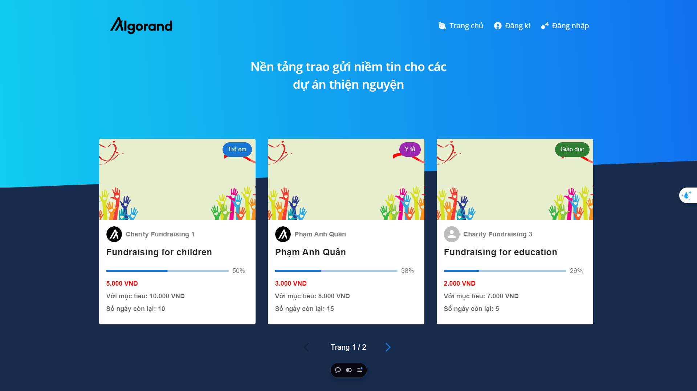
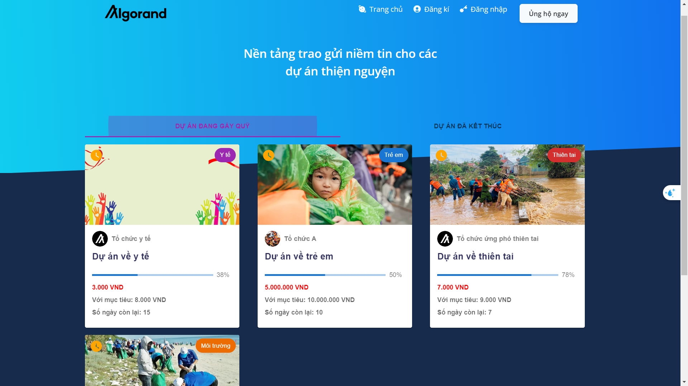
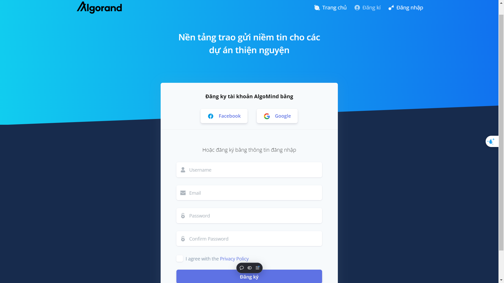
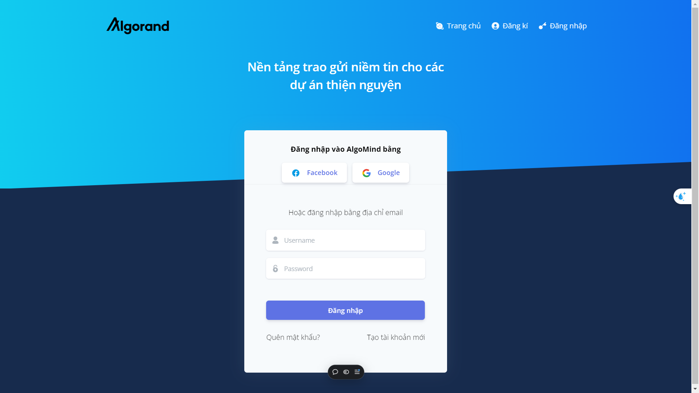
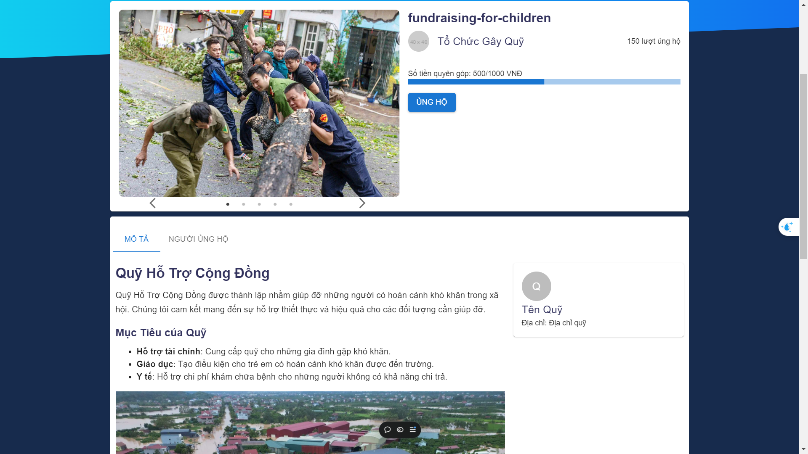

# [AlgoMind Dashboard - Giao diện quản lỹ quỹ từ thiện]()

 
[](https://discord.gg/7yQgN4Ex)


## Detailed Description
**Backend (FastAPI)**

link: https://github.com/nhoc20170861/algomind-be

1. User Authentication:
    * Implements a secure user authentication system using FastAPI.
    * Supports features such as user registration, login, password hashing, and JWT-based session management.
    * Ensures compliance with modern security practices like rate limiting and password encryption.

2. Charity Fund Management:

    * Provides APIs for creating, updating, and managing charity funds.
    * Tracks fund performance and aggregates donations from various transactions.

3. Project Management for Charity Funds:

    * Enables CRUD (Create, Read, Update, Delete) operations on projects associated with specific charity funds.
    * Allows fund administrators to allocate resources to projects and track progress.

4. Transaction Handling:

    * Integrates with the Algorand blockchain through AlgoSDK to record and verify transactions.
    * Handles incoming transactions, validates data, and stores transaction records in the database.
    * Computes and stores relevant metrics, such as total donations and donor participation.

**Database (PostgreSQL)**

1. User Data:
Stores user profiles, including authentication credentials, personal information, and access roles.

2. Charity Fund and Project Data:

    * Maintains records of all charity funds and their associated projects.
    * Tracks project-specific details such as budgets, milestones, and fund allocations.

3. Transaction Data:

    * Logs all transactions linked to donations and withdrawals, including metadata such as transaction IDs, timestamps, and donor information.
    * Supports efficient queries to generate reports and analytics.

**Frontend (ReactJS)**

1. User Interface:

    * Built using Material-UI for a modern and responsive design.
    * Adopts Creative Admin dashboard templates to create a visually appealing and user-friendly interface.
    * Features intuitive navigation for both donors and fund administrators.

2. Charity Fund and Project Dashboard:

    * Displays key metrics and progress updates for charity funds and projects.
    * Provides real-time updates using data fetched from the backend APIs.

3. Transaction Integration:

    * Leverages AlgoSDK to allow users to make donations and track transactions directly on the Algorand blockchain.
    * Provides a seamless experience for donors to contribute to their desired projects with transparent transaction details.

4. Real-Time Analytics and Reporting:

    * Generates graphical reports, such as donation trends and project progress, for fund administrators.
    * Allows filtering and sorting of transaction data to provide actionable insights.
      
5. Blockchain Interaction (AlgoSDK)

    * Establishes secure connections to the Algorand blockchain.
    * Enables functionalities like:
        * Sending and receiving transactions.
        * Fetching transaction histories for donors and charity funds.
        * Ensuring transparency and immutability of donation records through blockchain-based validation.
.

**Example Pages**

If you want to get inspiration or just show something directly to your clients, you can jump start your development with our pre-built example pages. You will be able to quickly set up the basic structure for your web project.

## Table of Contents

- [Versions](#versions)
- [Demo](#demo)
- [Quick Start](#quick-start)
- [Documentation](#documentation)
- [File Structure](#file-structure)
- [Browser Support](#browser-support)
- [Resources](#resources)
- [Licensing](#licensing)
- [Useful Links](#useful-links)

## Versions

[](https://www.creative-tim.com/product/argon-dashboard?ref=adr-github-readme)[](https://www.creative-tim.com/product/argon-dashboard-react?ref=adr-github-readme)[](https://www.creative-tim.com/product/argon-dashboard-nodejs?ref=adr-github-readme)

## Demo

| Home Page                                                                        | ProjectList Page                                                                               | Maps Page                                                                                                                                                                                        |
| -------------------------------------------------------------------------------- | ---------------------------------------------------------------------------------------------- | ------------------------------------------------------------------------------------------------------------------------------------------------------------------------------------------------ |
| [](https://fund-management-lovat.vercel.app/) | [](ttps://fund-management-lovat.vercel.app/du-an) | [](https://demos.creative-tim.com/argon-dashboard-react/#/admin/maps) |

| Register Page                                                                                    | Login Page                                                                              | FundDetail Page                                                                                                     |
| ------------------------------------------------------------------------------------------------ | --------------------------------------------------------------------------------------- | ------------------------------------------------------------------------------------------------------------------- |
| [](https://fund-management-lovat.vercel.app/register) | [](https://fund-management-lovat.vercel.app/login) | [](https://fund-management-lovat.vercel.app/du-an/fundraising-for-children) |

[View More](https://fund-management-lovat.vercel.app/)

## How to run

- Clone the repo: `git clone https://github.com/AlgoRMind/frontend`.
- `npm i && npm run start dev`
- visit `http://localhost:4000` to see dashboard

## Documentation

The documentation for the Material Kit is hosted at our [website](https://demos.creative-tim.com/argon-dashboard-react/#/documentation/overview).

## File Structure

Within the download you'll find the following directories and files:

```
Argon Dashboard React
.
├── Documentation
│   └── documentation.html
├── CHANGELOG.md
├── ISSUE_TEMPLATE.md
├── LICENSE
├── README.md
├── package.json
├── public
│   ├── favicon.ico
│   ├── index.html
│   └── manifest.json
└── src
    ├── assets
    │   ├── css
    │   │   ├── argon-dashboard-react.css
    │   │   ├── argon-dashboard-react.css.map
    │   │   └── argon-dashboard-react.min.css
    │   ├── fonts
    │   │   └── nucleo
    │   ├── img
    │   │   ├── brand
    │   │   ├── icons
    │   │   │   └── common
    │   │   └── theme
    │   ├── scss
    │   │   ├── argon-dashboard-react.scss
    │   │   ├── bootstrap
    │   │   │   ├── mixins
    │   │   │   └── utilities
    │   │   ├── core
    │   │   │   ├── alerts
    │   │   │   ├── avatars
    │   │   │   ├── badges
    │   │   │   ├── buttons
    │   │   │   ├── cards
    │   │   │   ├── charts
    │   │   │   ├── close
    │   │   │   ├── custom-forms
    │   │   │   ├── dropdowns
    │   │   │   ├── footers
    │   │   │   ├── forms
    │   │   │   ├── headers
    │   │   │   ├── icons
    │   │   │   ├── list-groups
    │   │   │   ├── maps
    │   │   │   ├── masks
    │   │   │   ├── mixins
    │   │   │   ├── modals
    │   │   │   ├── navbars
    │   │   │   ├── navs
    │   │   │   ├── paginations
    │   │   │   ├── popovers
    │   │   │   ├── progresses
    │   │   │   ├── separators
    │   │   │   ├── tables
    │   │   │   ├── type
    │   │   │   ├── utilities
    │   │   │   └── vendors
    │   │   ├── custom
    │   │   └── react
    │   └── vendor
    │       ├── @fortawesome
    │       │   └── fontawesome-free
    │       │       ├── LICENSE.txt
    │       │       ├── css
    │       │       ├── js
    │       │       ├── less
    │       │       ├── scss
    │       │       ├── sprites
    │       │       ├── svgs
    │       │       │   ├── brands
    │       │       │   ├── regular
    │       │       │   └── solid
    │       │       └── webfonts
    │       └── nucleo
    │           ├── css
    │           └── fonts
    ├── components
    │   ├── Footers
    │   │   ├── AdminFooter.jsx
    │   │   └── AuthFooter.jsx
    │   ├── Headers
    │   │   ├── Header.jsx
    │   │   └── UserHeader.jsx
    │   ├── Navbars
    │   │   ├── AdminNavbar.jsx
    │   │   └── AuthNavbar.jsx
    │   └── Sidebar
    │       └── Sidebar.jsx
    ├── index.js
    ├── layouts
    │   ├── Admin.jsx
    │   └── Auth.jsx
    ├── routes.js
    ├── variables
    │   └── charts.jsx
    └── views
        ├── Index.jsx
        └── examples
            ├── Icons.jsx
            ├── Login.jsx
            ├── Maps.jsx
            ├── Profile.jsx
            ├── Register.jsx
            └── Tables.jsx
```

## Browser Support

At present, we officially aim to support the last two versions of the following browsers:

    


## Licensing

- Copyright 2023 Creative Tim (https://www.creative-tim.com/?ref=adr-github-readme)

- Licensed under MIT (https://github.com/creativetimofficial/argon-dashboard-react/blob/master/LICENSE.md?ref=creativetim)

## Useful Links

- [Tutorials](https://www.youtube.com/channel/UCVyTG4sCw-rOvB9oHkzZD1w?ref=creativetim)

